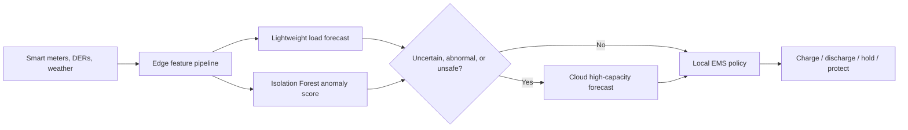
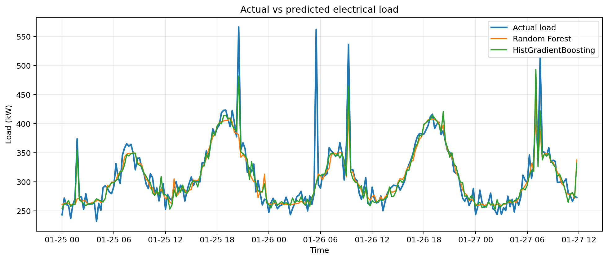
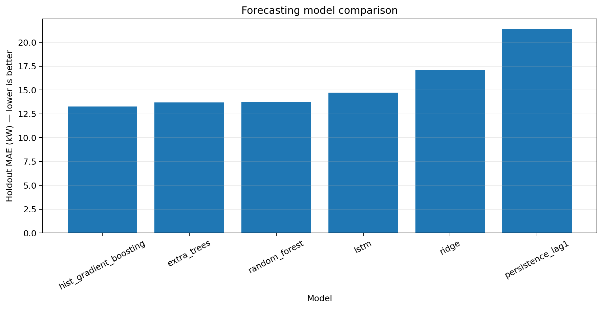
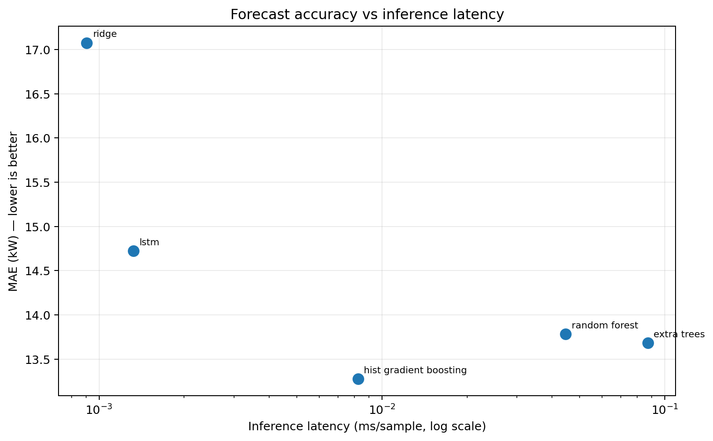
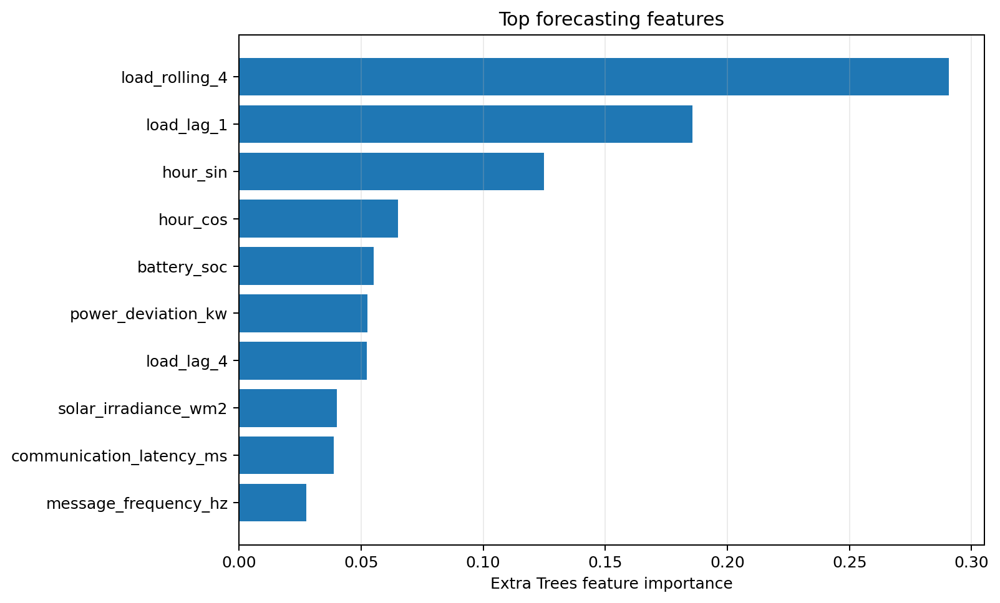
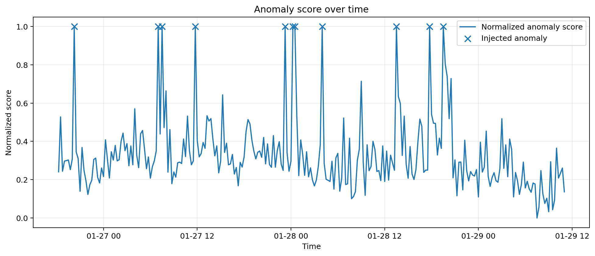
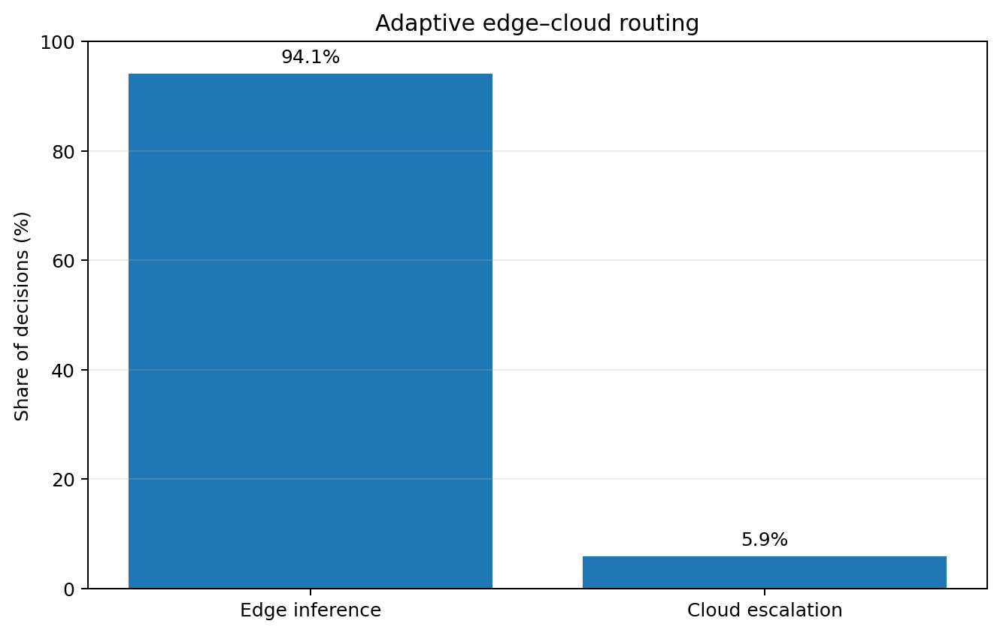

# Adaptive Edge–Cloud Energy Management for Smart Grids

A GitHub-ready research prototype that adapts the **edge–cloud collaboration** theme from IoT threat detection to **smart-grid energy management**. It forecasts electrical load, detects abnormal operating states, routes difficult cases from a lightweight edge model to a stronger cloud model, and emits explainable battery/grid actions.

> **Research and education only.** This software does not operate real switchgear and is not certified for grid protection, dispatch, billing, or safety-critical control.

## What is included

- Synthetic 15-minute smart-grid telemetry generator (load, renewable generation, weather, battery SoC, voltage, and frequency)
- Causal time-series feature engineering
- Lightweight edge load forecaster: `RandomForestRegressor`
- Higher-capacity cloud forecaster: `ExtraTreesRegressor`
- Unsupervised abnormal-state detector: `IsolationForest`
- Adaptive routing using model uncertainty, anomaly score, and hard safety limits
- Explainable actions: charge, discharge, preserve battery, hold, or isolate/protect
- Command-line interface, YAML configuration, tests, CI, Docker, and a starter notebook
- Industrial adapters for MQTT, REST, read-only Modbus, and read-only CAN integrations
- AWS SAM example for AWS IoT-triggered Lambda processing and encrypted S3 storage
- Traceable JSONL security events with hashed device identifiers
- Optional One-Class SVM, statistical thresholding, and PyTorch autoencoder experiments
- Research benchmark suite with persistence/Ridge/tree/boosting baselines, optional PyTorch LSTM, rolling time-series backtesting, feature ablation, model-size/latency profiling, and feature importance

## Architecture



## Quick start

Python 3.10+ is required.

```bash
python -m venv .venv
# Linux/macOS: source .venv/bin/activate
# Windows PowerShell: .venv\Scripts\Activate.ps1
python -m pip install -e ".[dev,notebook]"
smartgrid-ems demo
smartgrid-ems research --include-lstm --lstm-epochs 8
pytest
```

For industrial protocol/AWS clients or the optional autoencoder:

```bash
python -m pip install -e ".[industrial,deep-learning]"
```

The demo writes:

- `data/grid_telemetry.csv` — generated telemetry
- `artifacts/models.joblib` — trained model bundle
- `reports/training_metrics.json` — forecast MAE/RMSE
- `reports/decisions.csv` — per-interval EMS decisions

The research suite additionally writes:

- `reports/research/forecast_benchmarks.csv` — classical + optional LSTM model comparison
- `reports/research/time_series_backtest.csv` — rolling-origin stability metrics
- `reports/research/ablation_study.csv` — feature-group ablations
- `reports/research/anomaly_benchmarks.csv` — detector precision/recall/F1
- `reports/research/feature_importance.csv` — ranked feature contributions
- `reports/research/research_summary.json` and `environment.json` — reproducibility metadata

Run each stage separately:

```bash
smartgrid-ems generate --output data/grid_telemetry.csv
smartgrid-ems train --data data/grid_telemetry.csv
smartgrid-ems simulate --data data/grid_telemetry.csv
```

## Use your own data

Supply a CSV containing these columns:

| Column | Unit / format |
|---|---|
| `timestamp` | ISO-8601 timestamp |
| `load_kw` | kW |
| `renewable_kw` | kW |
| `temperature_c` | °C |
| `solar_irradiance_wm2` | W/m² |
| `wind_speed_ms` | m/s |
| `voltage_pu` | per-unit voltage |
| `frequency_hz` | Hz |
| `battery_soc` | 0–1 |
| `communication_latency_ms` | milliseconds |
| `message_frequency_hz` | messages/second |
| `device_state_transition` | 0/1 state-change indicator |
| `is_anomaly` | 0/1; use 0 if labels are unavailable |

Data are split chronologically (first 80% training, last 20% evaluation) to reduce time leakage. Tune thresholds and operating limits in [`config/default.yaml`](config/default.yaml). For a 60 Hz grid, change the frequency limits before use.

## Algorithms and tools

- **Tools:** Python, pandas, NumPy, scikit-learn, PyTorch, MQTT, REST, Modbus, CAN, AWS IoT Core, Lambda, S3, EC2 deployment guidance, Jupyter, pytest, GitHub Actions, Docker, and AWS SAM.
- **Forecasting:** persistence baseline, Ridge, Random Forest, Extra Trees, HistGradientBoosting, and optional multivariate LSTM.
- **Anomaly detection:** Isolation Forest, One-Class SVM, robust statistical thresholding, and optional autoencoder experiments.
- **Research evaluation:** chronological holdout, rolling-origin backtesting, feature ablation, feature importance, inference-latency profiling, serialized model-size comparison, and reproducibility metadata.
- **Orchestration:** ensemble-variance uncertainty estimation, anomaly-aware edge-to-cloud escalation, and rule-based battery/safety dispatch.

## ML research engineering highlights

The project separates the **runtime EMS path** from a **research experimentation path**. This makes it possible to compare candidate algorithms against simple baselines, quantify the value of feature groups, measure temporal stability across folds, and evaluate the accuracy/latency/model-size trade-off before selecting an edge or cloud model. The experiments are deterministic where practical, use chronological splits, fit scalers only on training data, and persist machine-readable results for reproducibility.

A verified synthetic-data run is documented in [`Docs/VALIDATION.md`](Docs/VALIDATION.md). In that run, HistGradientBoosting achieved the best single-holdout MAE (13.28 kW), while Random Forest achieved the best mean MAE across four rolling time folds (13.68 kW). The compact 8-epoch LSTM used about 31 KB of serialized weights, illustrating a different accuracy/footprint trade-off. These are software-validation results on synthetic data, not claims of real-grid performance.

## Results & visualizations

The repository includes reproducible portfolio figures generated from the synthetic validation workflow. Recreate them at any time with:

```bash
python scripts/generate_figures.py
```

### Load forecasting



The forecasting benchmark compares persistence, Ridge, Random Forest, Extra Trees, HistGradientBoosting, and an optional PyTorch LSTM.



### Accuracy–efficiency trade-off



### Feature importance



### Anomaly detection



### Adaptive edge–cloud routing



> All figures above are generated from the repository's reproducible **synthetic-data validation**. They demonstrate the software/ML workflow and are not claims of real-grid field performance.

## Repository layout

```text
config/                 operating and model configuration
docs/                   architecture and adaptation notes
infra/                  AWS Lambda/S3 SAM infrastructure example
notebooks/              executed research and visual-results notebooks
results/figures/         portfolio-ready plots embedded in this README
scripts/                 reproducible figure-generation utilities
src/smartgrid_ems/      reusable Python package and CLI
tests/                  unit and integration tests
.github/workflows/      continuous integration
Dockerfile              container execution
```

## Responsible extension to real systems

Before field use, replace synthetic data with a governed dataset; define region-specific voltage/frequency constraints; add time-series backtesting, calibration, drift monitoring, cybersecurity, authentication, audit logs, fail-safe local control, and hardware-/software-in-the-loop validation. Commands should pass through an independently certified protection and interlock layer.

## Attribution

This is an independent thematic adaptation inspired by the edge–cloud collaboration idea in *Adaptive Edge-Cloud Collaboration for Dynamic Threat Detection in IoT Networks*. It is not an official derivative, reproduction, or validated implementation of that paper, and it contains independently written code.

